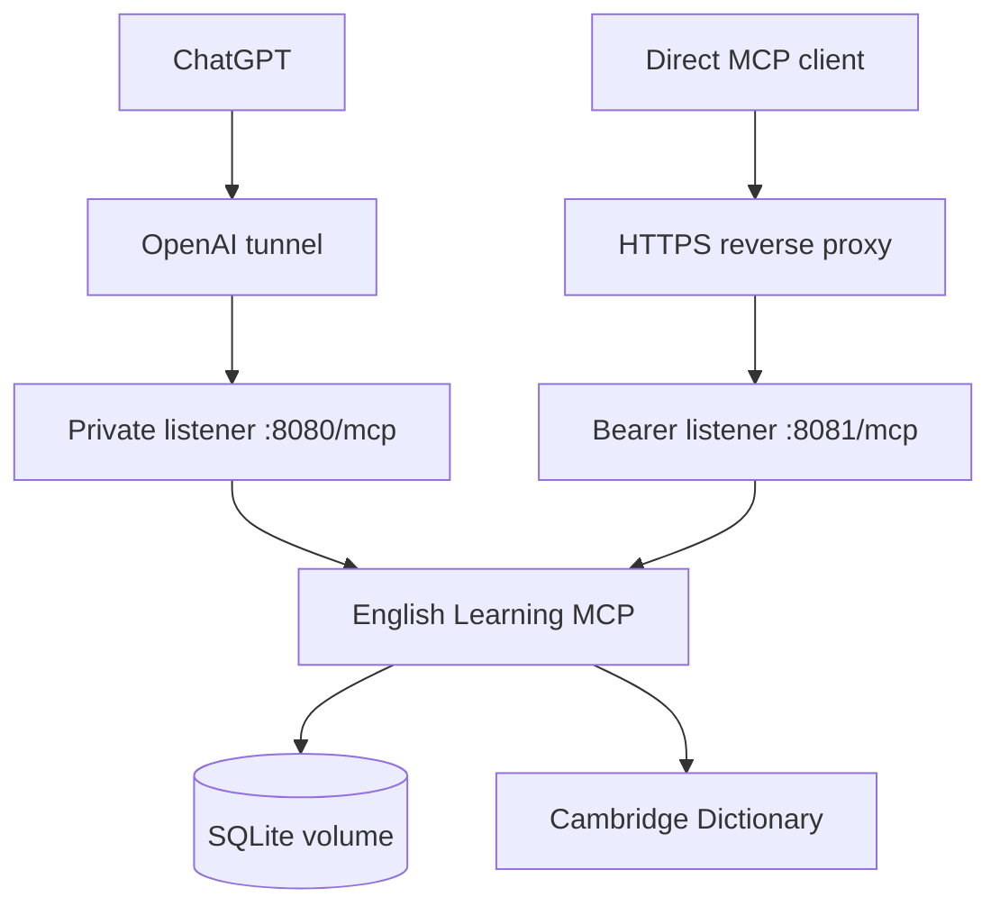

# Deployment

The supplied Docker Compose stack runs the MCP server and the OpenAI tunnel client from one built image.



Both listeners expose the same stateless Streamable HTTP tools, owner namespace, and SQLite database. Their access policies differ:

| Listener | Intended access | Authentication |
|---|---|---|
| `:8080/mcp` | `openai-tunnel` on the private Docker network | None |
| `:8081/mcp` | HTTPS reverse proxy and direct MCP clients | Bearer token |

Never publish or publicly route port `8080`.

## Start the stack

```sh
cp .env.example .env
```

Set the OpenAI tunnel values and a direct-client bearer token in `.env`, then run:

```sh
docker compose up -d --build
docker compose logs -f
```

The application applies embedded, checksum-verified SQLite migrations automatically during startup.

## Reverse proxy

Terminate TLS at the reverse proxy and route only the exact `/mcp` path to `english-learning-mcp:8081` on the Docker network. The container intentionally serves plain HTTP internally and rejects requests to other paths.

Example Traefik labels:

```yaml
labels:
  - traefik.enable=true
  - traefik.http.routers.english-mcp.rule=Host(`english-mcp.example.com`) && Path(`/mcp`)
  - traefik.http.routers.english-mcp.entrypoints=websecure
  - traefik.http.routers.english-mcp.tls=true
  - traefik.http.routers.english-mcp.middlewares=english-mcp-rate-limit
  - traefik.http.services.english-mcp.loadbalancer.server.port=8081
  - traefik.http.middlewares.english-mcp-rate-limit.ratelimit.average=60
  - traefik.http.middlewares.english-mcp-rate-limit.ratelimit.period=1m
  - traefik.http.middlewares.english-mcp-rate-limit.ratelimit.burst=20
```

Add the certificate resolver and Docker network required by your Traefik or Dokploy installation. In Dokploy, target the `english-learning-mcp` service, container port `8081`, and path `/mcp`.

## Persistence

Compose stores the database at `/app/data/english-mcp.sqlite` in the `english-learning-data` named volume. Rebuilding or replacing containers preserves it.

Do not run `docker compose down -v` unless you intentionally want to delete all vocabulary, dictionary snapshots, and scheduling data. Back up the volume before infrastructure changes. Stop the MCP container or use a SQLite-aware backup method so the database and any WAL state are captured consistently.

## Updating

Pull the desired source revision, review changes and migration notes, then rebuild:

```sh
docker compose up -d --build
```

Migrations run transactionally. Startup fails rather than silently continuing if an applied migration is missing, newer than the executable, or has a different checksum.

## Security checklist

- Expose only HTTPS to direct clients.
- Keep `:8080` private to the tunnel container.
- Use a unique bearer token with at least 32 bytes of randomness.
- Keep `.env` out of version control.
- Apply reverse-proxy request limits appropriate to your deployment.
- Restrict access to the Docker volume and its backups.
- Treat `MCP_OWNER_KEY` as namespacing, not an authentication mechanism.
