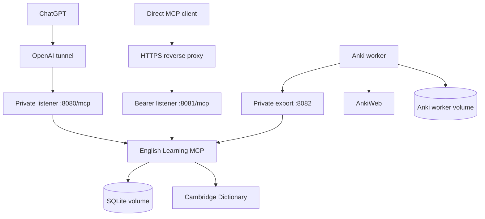

# Deployment

The single `docker-compose.yml` runs the MCP server, OpenAI tunnel client, and Anki worker. The MCP server and tunnel share the Go image; the worker has its own Python image and persistent volume.



The two MCP listeners expose the same stateless Streamable HTTP tools, owner namespace, and SQLite database. The third listener serves only vocabulary exports:

| Listener | Intended access | Authentication |
|---|---|---|
| `:8080/mcp` | `openai-tunnel` on the private Docker network | None |
| `:8081/mcp` | HTTPS reverse proxy and direct MCP clients | Bearer token |
| `:8082/internal/anki/snapshot` | Anki worker on the private Docker network | Separate export bearer token |

Never publish or publicly route ports `8080` or `8082`.

## Start the stack

```sh
cp .env.example .env
```

Set the OpenAI tunnel values, MCP bearer token, separate Anki export token, and AnkiWeb credentials in `.env`, then run:

```sh
docker compose up -d --build
docker compose logs -f
```

The application applies embedded, checksum-verified SQLite migrations automatically during startup.

### Dokploy

1. Use a Docker Compose application with the repository's `docker-compose.yml`.
2. Copy `.env.example` into Dokploy's **Environment** settings and fill in `CONTROL_PLANE_API_KEY`, `CONTROL_PLANE_TUNNEL_ID`, `MCP_BEARER_TOKEN`, `ANKI_EXPORT_TOKEN`, `ANKIWEB_USERNAME`, and `ANKIWEB_PASSWORD`.
3. Generate the two bearer tokens independently with `openssl rand -base64 32`. The export token must differ from the MCP token.
4. Deploy the stack. No override file, Compose profile, or host secret-file mount is required.
5. Route your public MCP domain only to `english-learning-mcp:8081/mcp`. Do not add a public domain for the worker or export listener.

Keep the existing Dokploy application/project identity when redeploying so its named volumes are reused. Protect access to Dokploy Environment and Docker: administrators with container-inspection access can read container environment credentials. For a local `.env`, single-quote passwords containing `$` to prevent Compose interpolation.

## Reverse proxy

Terminate TLS at the reverse proxy and route only the exact `/mcp` path to `english-learning-mcp:8081` on the Docker network. The container intentionally serves plain HTTP internally and rejects requests to other paths.

Example Traefik labels:

```yaml
labels:
  - traefik.enable=true
  - traefik.http.routers.english-mcp.rule=Host(`english-mcp.example.com`) && Path(`/mcp`)
  - traefik.http.routers.english-mcp.entrypoints=websecure
  - traefik.http.routers.english-mcp.tls=true
  - traefik.http.routers.english-mcp.middlewares=english-mcp-rate-limit
  - traefik.http.services.english-mcp.loadbalancer.server.port=8081
  - traefik.http.middlewares.english-mcp-rate-limit.ratelimit.average=60
  - traefik.http.middlewares.english-mcp-rate-limit.ratelimit.period=1m
  - traefik.http.middlewares.english-mcp-rate-limit.ratelimit.burst=20
```

Add the certificate resolver and Docker network required by your Traefik or Dokploy installation. In Dokploy, target the `english-learning-mcp` service, container port `8081`, and path `/mcp`.

## Persistence

Compose stores the database at `/app/data/english-mcp.sqlite` in the `english-learning-data` named volume. Rebuilding or replacing containers preserves it.

Do not run `docker compose down -v` unless you intentionally want to delete all vocabulary, dictionary snapshots, and scheduling data. Back up the volume before infrastructure changes. Stop the MCP container or use a SQLite-aware backup method so the database and any WAL state are captured consistently.

## Updating

Pull the desired source revision, review changes and migration notes, then rebuild:

```sh
docker compose up -d --build
```

Migrations run transactionally. Startup fails rather than silently continuing if an applied migration is missing, newer than the executable, or has a different checksum.

## Security checklist

- Expose only HTTPS to direct clients.
- Keep `:8080` and `:8082` private.
- Use a unique bearer token with at least 32 bytes of randomness.
- Keep `.env` out of version control.
- Apply reverse-proxy request limits appropriate to your deployment.
- Restrict access to the Docker volume and its backups.
- Treat `MCP_OWNER_KEY` as namespacing, not an authentication mechanism.

## AnkiWeb sync

The included worker uses the official headless Python `anki` library, not AnkiConnect or desktop Anki. Saved vocabulary is authoritative: all saved statuses, including archived items, produce cards; cached lookups alone do not. Distinct saved senses produce distinct cards.

The dedicated deck is exclusively managed. Every successful cycle restores server fields and tags, moves managed cards back, recreates remotely deleted notes, deletes vocabulary removed from the server, and removes manually added cards from the managed deck. Other decks remain outside this authority. Do not use the managed deck for personal cards. Existing cards retain their Anki scheduling when content changes; deleting a note in Anki can lose its history when recreated. Anki reviews never update application learning records.

### Setup

Set these values in Dokploy Environment or your local `.env`:

| Variable | Value |
|---|---|
| `ANKI_EXPORT_TOKEN` | A separate random bearer token, at least 32 bytes. |
| `ANKIWEB_USERNAME` | Your AnkiWeb account email. |
| `ANKIWEB_PASSWORD` | Your AnkiWeb password. |
| `ANKI_SOURCE_NAMESPACE` | Stable integration namespace; default `english-mcp`. |
| `ANKI_DECK` | Exclusively managed deck; default `English MCP`. |
| `ANKI_POLL_SECONDS` | Polling interval; default `60`. |

Compose requires the export token and account credentials before deployment and enables the exporter and worker together. Credentials are passed only to services that need them: the Go service gets the export token, while only the worker gets the AnkiWeb account credentials. Start or redeploy:

```sh
docker compose up -d --build
docker compose logs -f anki-worker
```

Port `8082` is not published and must never be routed through the tunnel or reverse proxy. The export credential grants snapshot reads only.

Allow outbound HTTPS to AnkiWeb, including authentication and sync shard redirects. Restricted sandboxes require host-side `sbx policy` changes for blocked hosts; no host desktop service is required.

The worker polls on startup and every 60 seconds by default. Dictionary mutations do not wait for AnkiWeb. A successful cycle means AnkiWeb accepted the reconciled state; clients receive it on their next Anki sync. A failed or incomplete export never means an empty vocabulary. A valid complete empty export deliberately clears managed content.

### Operations

Inspect health and the last accepted snapshot:

```sh
docker compose exec anki-worker python -m anki_worker status
```

For a one-off sync, stop the polling worker first; overlapping collection access is rejected by a persistent lock:

```sh
docker compose stop anki-worker
docker compose run --rm anki-worker once
docker compose up -d anki-worker
```

To renew authentication, update `ANKIWEB_PASSWORD` in Dokploy Environment or `.env`. Stop the worker, run `docker compose run --rm anki-worker login` with the updated environment, then recreate it with `docker compose up -d anki-worker` or redeploy in Dokploy. A container restart alone does not load changed environment values. Authentication failures remain unhealthy rather than repeatedly attempting rapid logins. Treat the reusable authentication state in the volume as a password.

### Backup and recovery

`anki-worker-data` contains the private collection, ownership mapping, authentication, and status. It is separate from `english-learning-data`; never mount the application database into the worker. Stop the worker before backing up the entire volume, and restore the collection and mapping together. Protect backups as secrets. Do not run two workers against one AnkiWeb account, even with separate local volumes.

The first connection downloads an existing remote collection before projection. Empty-account bootstrap is handled separately. Required full downloads trigger another reconciliation. The worker refuses an ambiguous full upload: uploading a fresh or partial local collection could erase unrelated remote notes. Resolve such errors by syncing a complete account collection in an official Anki client, backing up both sides, and following the reported recovery instructions; do not delete worker state to bypass safety checks.

Persisted account/source identity prevents accidental volume reuse. For a different account or source, use a separate volume and account rather than editing identity files. Deck and note-type IDs survive display-name changes. Incompatible note-type schema changes are refused rather than silently dropping notes; preserve a backup of both collection and mapping before any operator-led schema repair.

If a manually added note has cards in both managed and unrelated decks, only its managed cards are removed. A tracked note converted to an incompatible type or expanded to multiple cards is refused with a backup and recovery message rather than deleting unrelated cards. Restore its one-card managed structure before retrying.

Vocabulary tags are encoded as `vocab::u` followed by lowercase UTF-8 hex. This preserves tag identity despite Anki's whitespace and case-insensitive tag rules; the worker owns the full tag set on its managed notes.

### Version upgrades and live verification

The worker image pins Python `3.14.7` and `anki==26.8.1`. The package was selected from [official PyPI metadata](https://pypi.org/project/anki/26.8.1/) and Python from the [official image manifest](https://github.com/docker-library/official-images/blob/master/library/python). Version-specific synchronization operations are isolated in the adapter.

Before upgrading, stop and back up the worker, verify the new stable package/runtime combination, run the local behavior checks, then exercise a disposable AnkiWeb account. Local collection tests and controlled sync doubles do not prove live protocol compatibility. Live checks need real disposable-account credentials and outbound access; never use a production account to test full-sync recovery.

For live integration, use a separate deployment environment containing only disposable-account credentials. Stop its polling worker before the test. The command requires an explicit acknowledgement and matching account email:

```sh
docker compose stop anki-worker
docker compose run --rm --no-deps \
  -e ANKI_LIVE_DISPOSABLE_ACCOUNT=I_UNDERSTAND_THIS_ACCOUNT_WILL_BE_MODIFIED \
  --entrypoint python anki-worker \
  -m anki_worker.live --disposable-account YOUR_DISPOSABLE_ACCOUNT_EMAIL
```

Use an empty disposable account with no prior managed deck/type. The command verifies remote emptiness before creating test content and uses synthetic snapshots instead of production vocabulary. It leaves account test content for inspection; delete that content afterward. `--rm` deletes the temporary container and its test collections/authentication; omit it when you need to inspect the printed artifact directory, then remove the stopped container afterward. Routine `unittest` discovery never invokes this command.

Live validation of the pinned combination succeeded, including the actual Go-export → worker → AnkiWeb path. The observed HTTPS hosts were `sync.ankiweb.net` and the redirected shard `sync12.ankiweb.net`. Shard assignment can change: permit the official redirects returned by AnkiWeb rather than hard-coding that shard as the sync endpoint.
