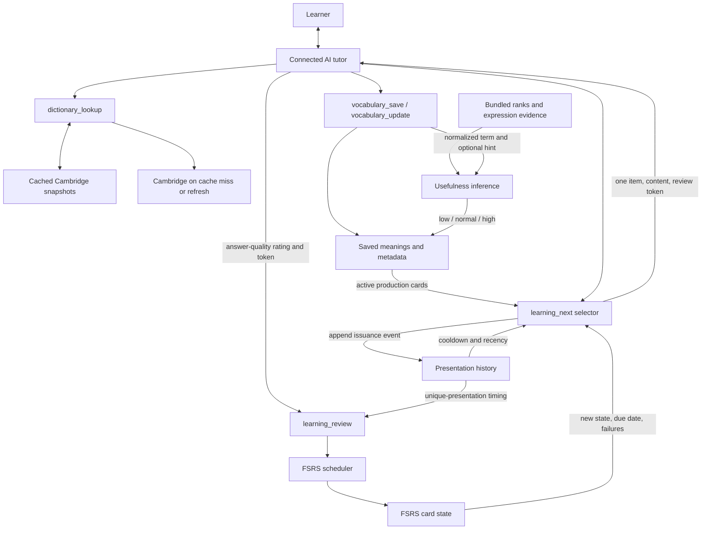
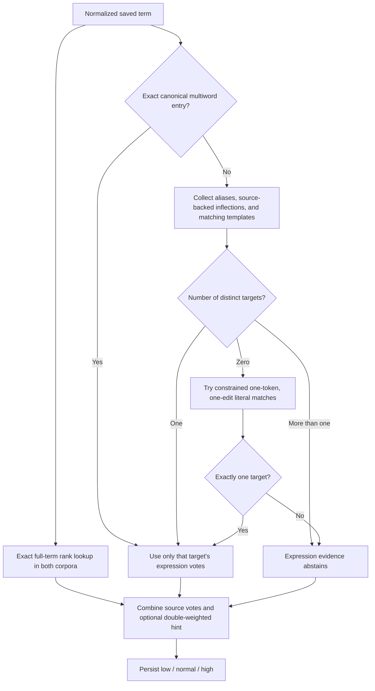
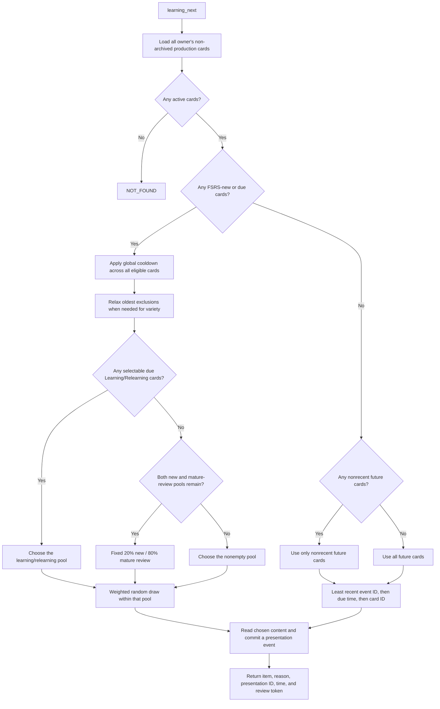
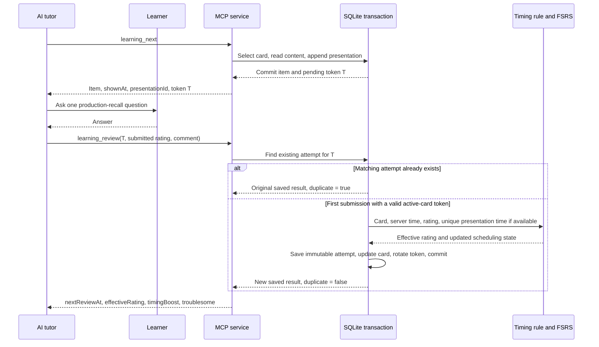
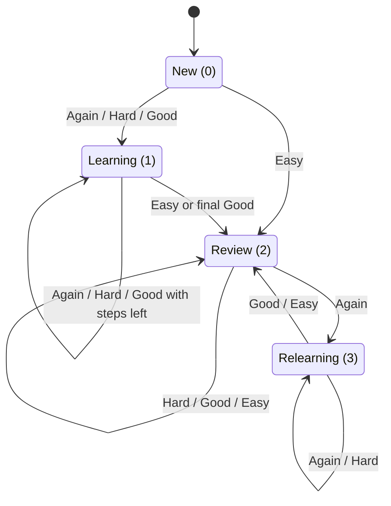
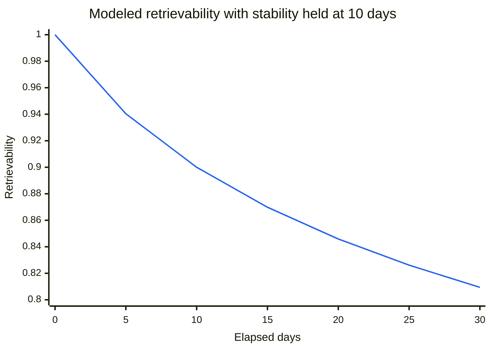

# How it works

English Learning MCP is the persistence and scheduling layer behind an AI English tutor. It gives an MCP host reliable tools and structured data; it does not generate lessons, definitions, or feedback by itself.

This guide describes the implemented algorithm, not an idealized spaced-repetition system. The important distinction is **which item to ask now** versus **when that item should next be reviewed**. Those are separate decisions.

Diagrams use Mermaid fenced blocks; formulas use LaTeX math. View this document in a Markdown renderer that supports both to see the rendered charts and equations.

## Reading map

- [System overview](#system-overview): the tutor, dictionary, vocabulary, selector, and scheduler.
- [Offline usefulness inference](#offline-usefulness-inference): evidence, hints, and classification.
- [How the next item is selected](#how-the-next-item-is-selected): eligibility, cooldown, exact weights, probabilities, and examples.
- [Learned-word reinforcement](#learned-word-reinforcement): comment-driven deep practice, personal interest, and the 25% word cap.
- [How a review changes the schedule](#how-a-review-changes-the-schedule): timing, FSRS equations, and state transitions.
- [Content precedence during reviews](#content-precedence-during-reviews): how the selected item becomes a question.
- [What affects what](#what-affects-what): direct influences, indirect influences, and things the algorithm ignores.
- [Implementation map](#implementation-map): the source files behind the rules.

## System overview

There is no single “best word” score and no language model running inside the selector. The system combines a deterministic usefulness heuristic, a partly random selection policy, and an FSRS memory model.



The three numerical decisions have different jobs:

| Decision | Question answered | Output | When it runs |
|---|---|---|---|
| Usefulness inference | How broadly useful is this term in English? | `low`, `normal`, or `high` | Save, explicit usefulness update, or inference-revision backfill |
| Next-item selection | Which eligible saved meaning should we practice now? | One card, then one presentation event | Every `learning_next` call |
| FSRS scheduling | Given the review result, when should this card be due again? | Updated memory state and due date | Every accepted, nonduplicate `learning_review` |

The tutor chooses explanations, questions, hints, and answer-quality ratings. The server does not inspect the learner's answer text, infer personal interests from conversation, or autonomously start a session. Optional Anki sync is one-way content publication; Anki reviews do not feed this MCP's scheduler.

## What it can do

The server can:

- look up words, phrases, idioms, phrasal verbs, and expressions on Cambridge Dictionary;
- cache complete lookup snapshots, including definitions, examples, pronunciation, audio, images, related words, idioms, and collocations;
- save a personal vocabulary item independently of a dictionary lookup;
- attach custom descriptions and source attribution, notes, examples, tags, learning status, and general usefulness;
- browse and filter saved vocabulary;
- choose exactly one item for production-recall practice;
- store immutable review attempts and optional notes about mistakes;
- use FSRS to schedule the next review;
- identify repeatedly failed or troublesome items.

The server cannot initiate a lesson or send a reminder. MCP is request/response: ChatGPT, another MCP host, or an external scheduler must decide when to call `learning_next`.

## The three data layers

### Dictionary snapshots

`dictionary_lookup` normalizes the requested term and checks SQLite first. A successful cached lookup is permanent for the current provider/parser version unless the caller explicitly requests a refresh.

On a cache miss, the server fetches and parses Cambridge Dictionary. A successful refresh creates a new immutable snapshot and makes it active. Legacy/context-only vocabulary with the same normalized term follows the current successful snapshot automatically. Dictionary-selected meanings retain their original snapshot so definition indices, part of speech, and pronunciation remain consistent.

Genuine not-found results can be cached, but an ordinary future lookup retries empty results. An HTTP 200 page without usable entries or suggestions is treated as an upstream failure rather than replacing good cached content. If an explicit refresh fails and an older snapshot exists for the current parser, the server returns it with `cache.state` set to `stale_fallback`. Parsed resource links allow only HTTP(S) URLs without embedded credentials.

### Vocabulary items

A vocabulary item belongs to the namespace configured by `MCP_OWNER_KEY` and represents one learnable meaning. Multiple items may have the same normalized term and can share a cached dictionary lookup, but have independent metadata, cards, and review histories. An item can exist without dictionary data and can contain:

- `new`, `learning`, `learned`, or `archived` status;
- `low`, `normal`, or `high` usefulness;
- independent `low`, `normal`, or `high` personal interest;
- normalized tags;
- a custom description with optional source attribution;
- ordered personal notes and examples;
- a saved context, whether or not a dictionary sense was selected;
- an optional selected dictionary definition and its immutable lookup snapshot, which contains all definitions.

Saving is idempotent for the same normalized term and selected definition. A different selected definition creates a separate item. Intentional edits go through `vocabulary_update`. Archived items stay stored but are excluded from practice.

Learning status is learner-managed metadata. FSRS reviews do not automatically change `new` to `learning` or `learned`; all three active statuses remain eligible for selection. Only `archived` removes an item from the review queue.

Usefulness estimates general English value, independently of personal interests, recall difficulty, and learning status. It combines bundled word-frequency and expression evidence with an optional API hint. Changing usefulness changes new-card selection weight, not due-review weight or FSRS review dates. Different saved senses share term-level evidence but can have different hints.

Personal interest records explicit learner priority: high for interesting/learn sooner, low for less important, normal to reset. It multiplies all weighted new/due selection pools and learned-word reinforcement, but never excludes low-interest items or changes FSRS. Existing items default to normal.

### Offline usefulness inference

The application embeds English ranks from [wordfreq](https://github.com/rspeer/wordfreq) and [FrequencyWords](https://github.com/hermitdave/FrequencyWords), plus expression data from Wiktionary/Kaikki, MAGPIE, and WordNet. Inference requires no external API, runtime download, Python process, or Cambridge lookup. These sources are historical and partly overlap; the combination is a transparent heuristic, not independent statistical evidence or a guarantee that a word is worth learning.

The two word-frequency sources vote only on exact normalized full-term matches:

| Rank in that source | Vote |
| --- | --- |
| 1–1,000 | `high` (+1) |
| 1,001–5,000 | `normal` (0) |
| Above 5,000 | `low` (−1) |
| Missing | Abstain |

Each matched source has weight 1. An explicitly supplied `usefulness` hint has weight 2, using the same −1/0/+1 values. A weighted mean strictly above ⅓ produces `high`; strictly below −⅓ produces `low`; the inclusive middle produces `normal`. With no evidence or hint, the result is `normal`.

For example, two `high` source votes and a `low` API hint produce `normal`, not a forced override in either direction. Two `high` votes and a `normal` hint still produce `high`. Omitting the hint is different from submitting `normal`: omission contributes no vote.

The word-rank path remains exact; it never estimates an idiom's frequency by combining individual word frequencies. Expression evidence is evaluated separately:

| Expression evidence | Vote |
| --- | --- |
| Wiktionary marks every retained sense for the normalized headword rare, archaic, obsolete, or dated | `low`, weight 1 |
| MAGPIE has confident idiomatic uses in at least 10 distinct documents | `high`, weight 1 |
| WordNet records at least 5 tagged occurrences | `high`, weight 1 |
| Mere dictionary presence, missing counts, or insufficient attestations | Abstain |

Unlabelled or unrestricted Wiktionary senses prevent a blanket restricted-usage judgement; the learner's chosen sense does not narrow that source evidence. MAGPIE counts only confident idiomatic uses (annotation confidence at least 0.75); literal, unclear, and false-extraction instances do not add idiomatic evidence. Its BNC candidates were capped at 200 per idiom type, with additional PMB examples not downsampled. These counts establish repeated attestation, not a population frequency ranking. WordNet tags likewise come from a limited annotated corpus. Small counts never imply that an expression is useless. The same weighted-mean rule combines these votes with the original API hint.

Wiktionary's generic `common` tag is not used as positive evidence: it can describe common law or a regional preference rather than overall frequency.

#### Exact usefulness formula

Let each voting source $j$ have value $v_j\in\{-1,0,+1\}$ and presence indicator $a_j\in\{0,1\}$. There are up to five source votes: two word-rank sources and the three expression sources above. Let $b=1$ when an API hint was supplied, otherwise $b=0$, and encode that hint as $h=-1,0,+1$.

$$
Q=\sum_j a_jv_j+2bh
\qquad
B=\sum_j a_j+2b
$$

$$
\operatorname{usefulness}=
\begin{cases}
\text{high} & 3Q>B\\
\text{low} & 3Q<-B\\
\text{normal} & \text{otherwise}
\end{cases}
$$

For $B>0$, this is the weighted mean $Q/B$ with strict cutoffs at $-1/3$ and $+1/3$. The code uses integer comparisons so the boundaries are exact. With $B=0$, both comparisons are false and the result is `normal`, without dividing by zero.

A `normal` vote is **not abstention**: it adds weight to the denominator but zero to the numerator. Expression counts are thresholded, not proportional: 10 qualifying MAGPIE documents and 1,000 qualifying documents each contribute just one high vote. Word ranks inside a band are likewise equal; rank 1 receives no stronger vote than rank 1,000.

| Evidence and hint | $Q$ | $B$ | Mean | Result |
|---|---|---|---|---|
| No evidence, no hint | 0 | 0 | Not computed | `normal` |
| No evidence, `high` hint | 2 | 2 | 1 | `high` |
| One high source, no hint | 1 | 1 | 1 | `high` |
| One high source, `normal` hint | 1 | 3 | $1/3$ | `normal` |
| One low source, `normal` hint | −1 | 3 | $-1/3$ | `normal` |
| Two high sources, `normal` hint | 2 | 4 | $1/2$ | `high` |
| Two high sources, `low` hint | 0 | 4 | 0 | `normal` |
| Restricted Wiktionary + qualifying MAGPIE + qualifying WordNet, no hint | 1 | 3 | $1/3$ | `normal` |

These are arithmetic examples, not claims that a particular spelling has those source ranks. A double-weighted hint is influential but is not an override.

#### How a term matches the evidence

The saved display spelling has whitespace trimmed/collapsed. The inference key additionally lowercases and converts curly single/double quotes to straight quotes. It does not strip other punctuation, normalize hyphens, remove words, or stem the term.



Matching follows these tiers, stopping at the first tier with a match:

1. **Exact canonical expression.** This takes precedence even if the entry contributes no votes.
2. **Aliases, first-verb inflections, and explicit templates together.** They are one competing tier, not an alias-first priority list. All matching paths must resolve to the same canonical target; an alias conflicting with a template makes expression evidence abstain.
3. **Constrained typo fallback.** Only when the preceding tier found no match, consider complete literal multiword surfaces with exactly one insertion, deletion, substitution, or adjacent transposition in one token. Both changed tokens must have at least four Unicode characters, and every other token and its order must match. If the changed input token ranks in the top 50,000 of either corpus, **all four edit types** are blocked. Multiple possible canonical targets abstain.

Ambiguous or unscored matches do not fall through to a more useful target. Finding the same target through several aliases does not multiply its votes.

First-verb variants require source evidence that the expression is verbal and an actual WordNet verb exception form for its first token. There is no general runtime inflection generator. Other variants must come from explicit source aliases/observations.

Templates have narrow, source-declared slots:

| Token in a source template | Accepted single-token replacements |
|---|---|
| `one's`, `someone's`, `somebody's` | `my`, `your`, `his`, `her`, `its`, `our`, `their`, `one's`, `someone's`, `somebody's` |
| `someone`, `somebody` | `me`, `you`, `him`, `her`, `it`, `us`, `them`, `someone`, `somebody` |

For example, a source template `keep one's chin up` can match `keep my chin up`; it does not make arbitrary names or extra words acceptable. `something` is not a wildcard. Template instantiation is not generally combined with typo correction; an independently attested literal surface can still be a typo target.

There is no arbitrary token removal, reordering, substring lookup, or semantic similarity. Matching affects inference only: it never corrects the saved spelling, merges saved meanings, or changes `vocabulary_get`/`vocabulary_list` lookup rules. Unknown or ambiguous expression evidence leaves the **independent exact full-term rank votes** intact. Only if those also abstain does the hint alone determine the result, or `normal` if omitted. A corrected expression target does not replace the saved input for word-rank lookup.

Cambridge definition `labels` can contain CEFR levels and usage information already captured by the dictionary parser. [CEFR labels](https://dictionary.cambridge.org/us/help/) describe learner proficiency, not a direct usefulness rating: advanced vocabulary is not automatically unnecessary. Offline inference does not fetch Cambridge or depend on its availability; the tutor may consider existing definition context when supplying a hint.

The commercial Linguatools collocation package is not bundled. It requires an actual licensed download; permission to use it privately does not provide the data.

The runtime consumes bundled source-order ranks, not live usage counts or wordfreq Zipf scores. Equal-frequency entries can have different ranks because source ordering is retained. Source overlap, historical coverage, and term-level aggregation limit what “usefulness” can mean: this is not a calibrated probability, personal relevance model, or score for the learner's exact selected sense.

#### Why saved hints and calculated results stay separate

The original API hint is stored separately from the effective result. Duplicate saves preserve both; a usefulness update replaces the hint and recalculates the result; unrelated updates preserve both. Migration `009` retains every previous usefulness value as a hint and recalculates existing vocabulary across all owners and statuses. Future dataset or scoring-policy revisions recalculate from those original hints, never from the previous calculated result. Revision-matched restarts do not rescan vocabulary. Backfills preserve existing timestamps, cards, review tokens, presentations, and review history.

| Operation | Original hint | Effective usefulness |
|---|---|---|
| Save with no hint | Absent (`NULL`) | Infer from sources alone |
| Save with a hint | Store the supplied category | Infer from sources plus hint |
| Save the same meaning again | Preserve | Preserve, even if the new request supplies a different hint |
| Update with `changes.usefulness` | Replace | Recalculate |
| Update other metadata only | Preserve | Preserve |
| Restart with the same inference revision | Preserve | Preserve; no vocabulary rescan |
| New dataset/scoring revision | Preserve | Recalculate for every owner and status |

The public `usefulness` field exposes the effective result, not the original hint. There is no API operation to clear an existing hint back to absence: omission preserves it and submitting `normal` adds a real weight-2 vote. Do not feed a returned result back as a new hint unless that is an intentional new assessment.

### Learning state

Every active vocabulary item has one production-recall card. The card stores FSRS scheduling state separately from the learning content. Each accepted review creates an immutable attempt containing the submitted rating, effective scheduling rating, schedule before and after the review, and an optional comment.

Review tokens prevent duplicate attempts. Retrying the same token with the same rating and comment returns the original result with `duplicate: true`; reusing it with different data is rejected.

Each committed `learning_next` selection also appends an immutable presentation event, atomically with selecting and reading the item. It records the owner, vocabulary and card IDs, exercise mode, current `reviewToken`, server issuance time (`shownAt`), scheduled due time at issuance, and selection kind (`new`, `due`, or `early`). The response exposes the event's `presentationId` and its UTC `shownAt`.

A presentation means the server issued an item, not that a learner saw it or answered it. Delivery may fail after the event commits. Retrying `learning_next` records a fresh presentation and may choose another item; it does not retry the same presentation idempotently. Multiple presentations before a review share the card's pending `reviewToken`. An accepted review rotates that token, so the saved token links presentations to the eventual review attempt without implying a separate attempt for every presentation.

Presentation and review history survives vocabulary deletion. Recorded timestamps are retained as facts; upgrading does not invent presentation events or past presentation times from existing cards or reviews. Consequently, pre-upgrade exposure, actual human visibility, and recall duration cannot be inferred from this history alone.

## Expected workflows

### Look up and save a new term

1. Call `dictionary_lookup` with the term.
2. Present the useful dictionary data to the learner.
3. Choose the relevant definition from the lookup and call `vocabulary_save` with its exact `definition`, an optional short `context`, and any initial metadata.

Lookup and saving are independent. A term may be saved first, and a later successful lookup will link itself automatically.

### Run one review

1. Call `learning_next` with `{}`.
2. If `reason` is `early`, end normal scheduled practice without asking a question or recording a review, unless the learner explicitly wants optional early practice. Otherwise use its definition, example, and latest problem comment to create one production-recall question without revealing `term`.
3. Let the learner answer.
4. Rate the answer and call `learning_review` with the unchanged `reviewToken`.
5. Explain the answer and use the returned schedule only as learner-facing context when helpful.

Rating guidance:

| Rating | Use when |
|---|---|
| `again` | The answer is absent or incorrect. |
| `hard` | The answer is correct only after substantial effort or a strong hint. |
| `good` | The answer is correct with ordinary effort and no material hint. |
| `easy` | Recall is immediate and confident. |

The tutor should add a short review comment only when a concrete confusion, failed cue, or useful hint will improve the next attempt.

The server also uses a **one-minute, positive-only timing signal**. For a `good` answer, if exactly one presentation exists for the owner, card, and pending review token and the review arrives within 60 seconds (inclusive), FSRS uses `easy`. The interval includes both AI turns, reading, and answering; it is supporting evidence rather than precise human recall time. Wrong or hinted answers must still be rated `again` or `hard` and never receive this boost.

Anything longer—including a morning question answered hours later—has no timing effect. Missing or repeated presentations and negative clock intervals also have no timing effect. The tutor must not treat delayed messages as hesitation or apply its own time-based adjustment. `learning_review` returns `effectiveRating` and `timingBoost`; retries use the original submitted rating and preserve the original result.

### Continue a lesson

After feedback, call `learning_next` again only when the learner wants another item. End normal practice on `reason: "early"` unless the learner explicitly opts into early practice, as described in the [reusable tutor prompts](prompts.md). The server deliberately has no session length or daily quota and still issues the early presentation; this stopping rule belongs to the tutor, not an API mode.

### Manage vocabulary

- Use `vocabulary_get` by `itemId` for one exact saved meaning. Term lookup works only while that spelling has one saved meaning.
- Use `vocabulary_list` for search, status/tag filters, and cursor pagination.
- Use `vocabulary_update` to replace selected metadata fields or archive/reactivate an item.
- Use `vocabulary_delete` only when the item should be removed. Dictionary snapshots remain cached; learning cards are deleted with the item, while review attempts and presentation events remain as immutable history.

## How the next item is selected

`learning_next` returns one active item when any exists, including an early review when no FSRS-new or due cards exist. It is not a “get only today's due cards” endpoint. If there are no active cards, it returns `NOT_FOUND`.

### Decision flow



The ordering matters: **eligibility → global adaptive cooldown → learning-step priority or fixed pool choice → within-pool weight**. A large weight cannot bypass an earlier stage.

### 1. Build the candidate pools

The selector loads all saved production cards for `MCP_OWNER_KEY` whose vocabulary status is not `archived`. It does not use a page from `vocabulary_list`, an oldest-new shortlist, or a tag filter.

For current server time $t$:

| Pool | Exact condition |
|---|---|
| New | `fsrs_state == 0`, regardless of the stored due date |
| Due learning/relearning | `fsrs_state` is Learning (1) or Relearning (3), and `due_at <= t` |
| Due mature review | `fsrs_state` is Review (2), and `due_at <= t` |
| Future | `fsrs_state != 0` and `due_at > t` |

“New” here is an **FSRS state**, not the vocabulary `status`. A saved item marked `learned` can still have an unreviewed FSRS-new card; a repeatedly reviewed item can still have learner-managed status `new`. The three active vocabulary statuses receive no different selection weights.

The unit of selection is a **saved meaning/card**, not a spelling. Two meanings of the same term have separate histories and can both be selected. There is no word-level deduplication across their cards.

### 2. Apply the short cooldown

A card is *recent* only when both conditions hold:

1. Its latest presentation is among the owner's last **three presentation events**, ordered by event ID for production practice.
2. The elapsed time since that presentation is **less than 30 minutes**.

This is not “all words shown in the last 30 minutes,” and the three events need not represent three distinct cards. Once an event falls outside the last three, its card can compete again immediately. New and mature-review cards still receive the softer recency penalty below; learning/relearning steps do not. At exactly 30 minutes the hard cooldown has expired.

Start by removing recent cards globally from the new and both due pools, before testing learning-step priority. Relax this exclusion only when it would prevent useful variety:

- If two or more candidates remain, keep the exclusion unchanged.
- If exactly one remains and it has never been presented or was last presented at least 30 minutes ago, keep that fresh alternative alone.
- If exactly one remains but it was shown within 30 minutes, also admit the least recently presented excluded eligible card, unless that card is the most recently presented active card.
- If none remain, admit the oldest eligible card and, unless it is the most recently presented active card, the second-oldest eligible card.
- Never admit a future card through this relaxation. Future cards' presentation IDs still identify the latest presentation, so two due cards can both compete when the last-shown card is not due yet.

When multiple surviving candidates belong to the chosen pool, this permits a weighted choice between older cards instead of forcing a fixed rotation. Pool priority can still leave only one selectable learning step, so a predictable sequence remains possible. With only two active cards, avoiding immediate repeats means alternation. With only one eligible card, it may repeat immediately; future cards do not become due just to add variety. Random draws can also happen to repeat an order.

“Oldest” compares each card's latest **event ID**, not its timestamp; ties use ascending card ID. This preserves issuance order even when events share a timestamp. Archived/deleted items' retained events can still occupy positions in the owner's last-three-event window; the latest active presentation is the greatest event ID among the loaded cards.

The implementation treats a negative elapsed interval after a backward clock change as recent when its ID is in the window. The recency weight clamps that interval to zero. This differs from review timing, where a negative interval supplies no boost.

### 3. Prioritize learning steps, otherwise choose new versus mature review

After adaptive cooldown and any relaxation, let $L$, $N$, and $R$ be the remaining due Learning/Relearning, New, and due mature Review pools:

| Nonempty eligible pools | Pool probability |
|---|---|
| Learning/relearning, with or without other pools | Learning/relearning: 1 |
| No learning/relearning; new and mature review | New: 0.2; mature review: 0.8 |
| New only | New: 1 |
| Mature review only | Mature review: 1 |

Selectable due learning steps pause both new introductions and mature reviews. This priority never bypasses cooldown: if all due learning/relearning cards remain excluded, other eligible cards supply spacing. A learning step that is not yet due does not pause either pool.

With no selectable learning steps and both other pools present, the **20% new / 80% mature review** split is fixed. Pool size, presentation recency, usefulness, urgency, and failures do not change it. Unseen new cards against just-presented mature reviews still receive 20% when both pools survive cooldown.

This is a random choice, not a quota or per-word repetition limit. Presentations change cooldown and within-pool recency; reviews change state and due dates. The available pools can therefore change from call to call, and a real session need not contain 20% new items.

### 4. Calculate each card's weight

Define `clamp(x, a, b) = min(max(x, a), b)`. All elapsed durations in these selection formulas are real elapsed hours/days, not calendar-day boundaries.

**Usefulness multiplier $U_i$:**

$$
U_i =
\begin{cases}
0.5 & \text{low}\\
1 & \text{normal}\\
2 & \text{high}
\end{cases}
$$

These categories are the **calculated, persisted results** of usefulness inference, not necessarily the tutor's submitted hints. They weight only FSRS-new cards, never due learning steps or mature reviews.

**Personal-interest multiplier $I_i$:** low = 0.5, normal = 1, high = 2. Unlike general usefulness, it multiplies all three weighted pools; it cannot bypass cooldown or pool priority.

**Presentation recency multiplier $\rho_i$:**

$$
\rho_i =
\begin{cases}
1 & \text{never presented}\\
0.25 + 0.75\,\operatorname{clamp}\left(
\frac{t-\text{lastShownAt}_i}{24\text{ hours}},0,1\right)
& \text{otherwise}
\end{cases}
$$

| Time since last presentation | Recency multiplier |
|---|---|
| Just now | 0.25 |
| 30 minutes | 0.265625 |
| 1 hour | 0.28125 |
| 6 hours | 0.4375 |
| 12 hours | 0.625 |
| 24 hours or more | 1 |
| Never presented | 1 |

The adaptive cooldown and this multiplier are separate mechanisms. A new or mature-review card leaving cooldown after 30 minutes has recovered eligibility, not full weight. Recency affects only its within-pool weight, never the pool ratio. Learning/relearning cards have no soft recency multiplier, but still obey the hard cooldown.

**Due urgency multiplier $A_i$:**

$$
H_i =
\begin{cases}
1/6 & \text{Learning or Relearning}\\
\max(24\,\text{scheduledDays}_i,24) & \text{Review}
\end{cases}
\qquad
A_i = 1 + \min\left(\frac{\max(\text{overdueHours}_i,0)}{H_i},4\right)
$$

Here $H_i$ is measured in hours. An exactly due card has urgency 1. For mature reviews, one full interval overdue gives 2; four or more intervals overdue gives the maximum 5, with a minimum interval of one day. A seven-day card one day overdue gets $1+1/7$, not 2. Learning/relearning uses a fixed **10-minute** denominator: 10 minutes overdue gives 2, and 40 minutes or more overdue gives 5, regardless of `scheduledDays`. This is a selector weight, not a change to FSRS's actual learning-step schedule.

**Failure multiplier $F_i$:**

$$
F_i = 1
+ 0.5\,\min(\text{consecutiveFailures}_i,2)
+ 0.25\,\min(\text{lapses}_i,3)
$$

For example, one consecutive failure and one lapse give 1.75. Two consecutive failures and three lapses give the maximum 2.75. Additional failures beyond these caps can still affect FSRS memory state; they add no further selection multiplier. A lapse is specifically a failed review from FSRS `Review` state, not every `again` answer.

**Final lottery weights:**

$$
W_i^{\text{new}} = \rho_i U_i I_i
\qquad
W_i^{\text{review}} = A_i F_i \rho_i I_i
\qquad
W_i^{\text{learning}} = A_i F_i I_i
$$

The possible ranges are 0.0625–4 for new-card weights, 0.125–27.5 for mature-review weights, and 0.5–27.5 for learning/relearning weights, before considering cooldown exclusion. Weights are relative lottery mass, not percentages, mastery scores, or FSRS recall probabilities. Worked examples below assume normal personal interest.

### 5. Draw within the chosen pool

For a card $i$ in the selected pool $P$:

$$
\Pr(i\mid P)=\frac{W_i}{\sum_{j\in P}W_j}
$$

When no learning/relearning cards are selectable and both other pools survive cooldown:

$$
\Pr(i)=
\begin{cases}
0.2\,W_i/\sum_{j\in N}W_j & i\in N\\
0.8\,W_i/\sum_{j\in R}W_j & i\in R
\end{cases}
$$

Here $N$ and $R$ contain candidates after adaptive cooldown. If $L$ is nonempty, its pool probability is 1 and all new/mature-review cards have probability zero for that call. An excluded card always has probability zero. A sole new or mature-review pool also has pool probability 1.

The implementation draws a pseudorandom value in $[0,1)$, multiplies it by the pool's total weight, and walks cumulative card weights until that draw is covered. There is no persistent shuffled queue or per-word quota. Every card in the chosen pool has positive weight, but the lottery does not guarantee that a particular card appears within a fixed number of calls.

#### Worked example: weights are not global priorities

Assume these mature Review-state cards are due and outside the hard cooldown, with no selectable learning/relearning steps:

| Card | Overdue / scheduled interval | Failures / lapses | Last presented | Usefulness | Weight |
|---|---|---|---|---|---|
| A | 0 / 2 days | 0 / 0 | At least 24 hours ago | `normal` | $1\times1\times1=1$ |
| B | 1 day / 2 days | 1 / 1 | 12 hours ago | `high` | $1.5\times1.75\times0.625=1.640625$ |
| C | 0 / 2 days | 0 / 0 | At least 24 hours ago | `low` | $1\times1\times1=1$ |

Total mature-review weight is 3.640625. If that pool is selected, A/B/C have approximately **27.47% / 45.06% / 27.47%** chances. A and C are equally likely because usefulness does not weight reviews. If a new pool also remains, it gets exactly **20%**, and the overall A/B/C probabilities are approximately **21.97% / 36.05% / 21.97%**.

For three otherwise equal new cards with low/normal/high usefulness, weights are 0.5/1/2 and within-pool probabilities are $1/7,2/7,4/7$. High is twice normal and four times low **within that pool**, not “a 200% chance.”

#### Worked example: cooldown outranks usefulness and the mix

Suppose the only due mature-review card was just presented, while a low-usefulness new card has never been presented. Cooldown removes the review card and preserves the fresh alternative; the new card wins with probability 1, regardless of its low usefulness or the fixed mix.

Now suppose the only eligible card is that recent due card, and every other card is a future review. The due card repeats. Future cards do not become eligible merely because the due card is on cooldown.

#### Worked example: learning-step priority respects spacing

Suppose a due Learning card is 10 minutes overdue with no failures or lapses, and a due Relearning card is 40 minutes overdue with one consecutive failure and one lapse. Both are selectable. Their weights are $2\times1=2$ and $5\times1.75=8.75$, so their probabilities are $8/43$ and $35/43$. Recent exposure outside the hard cooldown and differing usefulness do not change those weights. All new and mature-review cards have probability zero while either learning step is selectable.

If both steps are instead excluded by the global cooldown and two other eligible cards remain, no relaxation is needed: those other cards supply spacing. With one new and one mature-review card remaining, their probabilities are 20% and 80%. Future learning steps do not gain priority before their due time.

### 6. Use the future fallback only when necessary

When there are **no new or due cards at all**:

1. Restrict to nonrecent future cards if any exist; otherwise use all future cards.
2. Choose the least recently presented by latest event ID, treating never-presented cards as ID 0.
3. Break equal exposure ties by earliest due time, then ascending card ID.

There is no weighted lottery here. Usefulness, personal interest, urgency, failure counts, and soft recency weights do not change this ordering. Due time is only a tie-breaker, not the primary priority.

For example, suppose two nonrecent future cards are due in one minute and one day, with latest presentation IDs 100 and 20 respectively. The one-day card wins because it was presented less recently, regardless of usefulness or failures. If neither was ever presented, both have ID 0 and the one-minute card wins the due-time tie-breaker. If all future cards are recent, the same event-ID/due-time/card-ID ordering applies across all of them.

Each issuance moves the selected card to the newest exposure position. A static future-only pool therefore rotates through every card rather than looping over a nearest-due subset. This guarantee assumes the pool stays future-only and unchanged as presentations accumulate; accepted reviews, new saves, or cards becoming due can change the path.

The API therefore permits **early reviews** and still records an early presentation. It does not wait until a due date, enforce a daily/session quota, or end the lesson automatically. The normal tutor workflow ends on `reason: "early"` without asking or recording an answer unless the learner explicitly opts into early practice; there is no separate API mode.

### 7. Record the presentation and explain the result

Selection, reading the chosen vocabulary/card, and inserting the presentation happen in one SQLite transaction. Presenting changes future cooldown/recency and creates possible review-timing evidence; it does not update stability, difficulty, due date, repetitions, or the pending review token.

The response's `reason` is computed **after** choosing the card, in this order:

| First matching condition | `reason` |
|---|---|
| FSRS-new | `new` |
| Due date is in the future | `early` |
| At least 2 consecutive failures **or** at least 3 lapses | `troublesome` |
| At least 1 consecutive failure | `failed` |
| Due before the start of the current **UTC day** | `overdue` |
| Otherwise | `due` |

These labels are not priority queues and are not inputs to the lottery. In particular, a card due earlier today can have urgency greater than 1 while its label remains `due`. A troublesome future card still has `reason: "early"` and can separately have `troublesome: true`.

The presentation's stored `selection_kind` is coarser: only `new`, `due`, or `early`. Tutors should use the chosen card rather than rerolling for a preferred reason or higher usefulness.

## Learned-word reinforcement

`reinforcement_next` is an explicit alternative to scheduled review for stronger production and nuanced usage of **learned** vocabulary. It is not an early FSRS review. The tutor receives the word, saved meaning, all nonempty dated comments from normal and reinforcement reviews, and independent practice state. It asks for a sentence from a description or situation while hiding the target, then guides around prior confusions. The server selects and stores feedback; it does not generate the question or judge answer text.

For meaning $i$, let $C_i$ count nonempty comments from both review channels, $D_i$ be reinforcement difficulty in $[0,4]$ (initially 0), and $R_i$ recover from 0.25 to 1 linearly over 24 hours since its last reinforcement presentation (1 if never presented). Its weight is:

$$
w_i = U_i I_i (1+\min(C_i,8))(1+D_i)R_i
$$

Both $U_i$ and $I_i$ use low/normal/high multipliers 0.5/1/2. All learned meanings retain positive weights. More comments are a bounded teaching-value heuristic, not proof of current inability; comment text is not analyzed automatically. Normal FSRS difficulty, failures, due dates, and learning cooldown are not inputs to this independent lottery.

Group by normalized term. Word weight is the **maximum** of its meaning weights, avoiding an automatic bonus merely for saving more senses. Assign proportional probability, cap any word exceeding 0.25, then redistribute remaining probability proportionally among uncapped words until all comply. Draw a word, then choose one of its learned meanings proportional to meaning weights. `selectionProbability` is the word's probability, summed across all its meanings, not the selected sense's probability.

Before drawing, exclude a whole normalized word for **six hours** after the latest reinforcement issuance among its saved meanings, including archived siblings. This hard cooldown is independent of the 24-hour soft recency weight and the normal learning cooldown. It persists across restart, starts even if no answer follows, and ends at exactly issuance + six hours. Future timestamps remain cooling down until that boundary.

At least four distinct learned words must remain outside cooldown. No learned vocabulary returns `NOT_FOUND`; fewer than four eligible words returns `INVALID_ARGUMENT` without issuing or extending anything. Neither cooldown nor the probability cap is relaxed. `eligibleWordCount` counts the post-cooldown pool. Exactly four eligible words forces uniform 25% probabilities; with more, weights influence the capped distribution. With four learned words total, each issuance pauses selection for six hours. The cap is per-call probability, not an empirical session quota; a word may repeat after expiry. Ordinary learning presentations and reinforcement feedback do not start or extend this cooldown.

Each successful next call records a presentation and a fresh independent `reviewToken`. It changes reinforcement recency, not status or FSRS. `reinforcement_review` accepts that token with `again`, `hard`, `good`, or `easy` and an optional factual comment. Difficulty changes by +1/+0.5/−0.5/−1 respectively, clamped to 0–4; review count, last rating, and timestamp persist separately. This encourages practice after difficulties and reduces weight after independent success. No timing boost applies.

Record the first genuine production attempt including usage; guided success cannot erase initial failure. An identical retry returns the original saved practice result, without another update; a conflicting payload fails. Normal and reinforcement tokens are not interchangeable. Status changes/deletion prevent new feedback, but already accepted review results remain idempotently retrievable. These operations never revise FSRS, usefulness, personal interest, or learner-managed status. Use `vocabulary_update` explicitly to express personal preferences.

See [tool inputs and outputs](tools.md#reinforcement_next) and the [standalone reinforcement prompt](prompts.md#learned-word-reinforcement). Raw tool results include the answer: hidden-word practice depends on the tutor and host not exposing that private context.

## How a review changes the schedule

### Review transaction and retry behavior



The service trims the token and comment, validates the rating, and captures the current UTC time. The review transaction checks for an existing attempt **before** resolving the current card:

- Same token, submitted rating, and trimmed comment: return the original saved result without scheduling again.
- Same token with a different rating or comment: `INVALID_ARGUMENT`.
- No existing attempt and no current card for that owner's token: `NOT_FOUND`.
- A current token for an archived item: `INVALID_ARGUMENT`.
- Otherwise: calculate scheduling, save the immutable attempt, update the card, and rotate its token atomically.

Consequently, a valid duplicate can still return its original result after later reviews, archiving, or deletion. It returns that attempt's schedule, not the latest schedule. A failed transaction does not partially record a review.

A due date is not an acceptance gate: a valid active-card token can be reviewed early. A presentation is also not a storage-level prerequisite, although the normal tutor workflow gets the token from `learning_next`; missing presentation history simply disables timing promotion.

### Submitted rating versus effective rating

Map `again`, `hard`, `good`, and `easy` to grades 1, 2, 3, and 4. Let $g$ be the submitted grade, $n$ the number of matching owner/card/token presentations, and $\tau$ the interval from the unique presentation to the captured review time.

$$
g_{\mathrm{effective}} =
\begin{cases}
4 & g=3,\ n=1,\ 0\leq\tau\leq60\text{ seconds}\\
g & \text{otherwise}
\end{cases}
$$

Only `good` can be promoted, and only to `easy`. There is no penalty for a long delay. Exactly 60 seconds qualifies; more than 60 seconds, a negative interval, zero presentations, or two or more presentations does not.

This is based on **server issuance**, including tutor processing and delivery, not a stopwatch on the learner's thought process. Asking for the same pending card twice makes timing ambiguous; the second issuance does not “restart” a unique-presentation timer.

The attempt keeps both grades. Comment history uses the submitted grade; the card's last rating and FSRS use the effective grade. Retry with the **original submitted** grade, even when the returned effective grade is `easy`.

### The FSRS model actually used here

The dependency is [`go-fsrs/v4` at `v4.0.0`](https://github.com/open-spaced-repetition/go-fsrs/tree/v4.0.0), whose implementation uses the **FSRS v6 model**. The module's `v4` is not the model's equation version. The service uses its default parameters:

| Parameter | Current value | Meaning |
|---|---|---|
| Requested retention $q$ | 0.9 | Target modeled recall probability when setting a day-scale interval |
| Maximum due delay $M$ | 36,500 days | Upper bound on the actual day-scale due delay |
| Short-term scheduling | Enabled | Use explicit learning/relearning steps |
| Learning steps | 1 and 10 minutes | Initial learning progression |
| Relearning steps | 10 minutes | Return after a failed review |
| Fuzz | Disabled | No random jitter in the FSRS due date |
| Model weights | Fixed defaults | No per-user fitting or history optimizer runs |

The selector is random; this scheduler is deterministic for the same card state, effective rating, and review time.

#### Card memory and counters

| Field | Meaning |
|---|---|
| Stability $S$ | Modeled days until recall probability decays to 0.9 |
| Difficulty $D$ | FSRS memory-model difficulty, constrained to 1–10; not dictionary or CEFR difficulty |
| FSRS state | `New=0`, `Learning=1`, `Review=2`, `Relearning=3` |
| Last review time | Previous accepted review time |
| Remaining steps | Progress through initial learning or relearning steps |
| Scheduled days / due date | The scheduled interval metadata and next due timestamp |
| Repetitions | Number of accepted reviews; duplicate retries do not increment it |
| Lapses | Number of `again` reviews whose **previous** FSRS state was `Review` |
| Consecutive failures | Number of consecutive **submitted** `again` ratings |

New cards start with zero-valued memory/counters, FSRS `New` state, and a due date at creation. Every accepted review updates memory, increments repetitions, and sets the last review time to now—even in minute-scale learning.

For consecutive failures $c$ and lapses $\ell$:

$$
c' =
\begin{cases}
c+1 & \text{submitted rating is again}\\
0 & \text{otherwise}
\end{cases}
\qquad
\ell'=\ell+
\mathbf{1}[\text{previous state is Review and effective rating is again}]
$$

$$
\text{troublesome}=(c'\geq2)\ \lor\ (\ell'\geq3)
$$

`again` in initial Learning or Relearning can extend the failure streak but adds no lapse. A successful response clears the streak, not cumulative lapses. Once a card reaches three lapses it remains troublesome across ordinary successful reviews. This flag tells the tutor to change the cue or address confusion; it does not add a special FSRS scheduling branch.

Vocabulary `new`/`learning`/`learned` labels remain unchanged by these transitions. Archiving blocks practice; reactivation preserves an existing card, including its schedule and history, rather than resetting it.

### State transitions and concrete first-review results

This diagram shows normal reachable states under the current learning steps. All grades shown are **effective grades**, after any timing promotion.



**First review of an FSRS-new card:**

| Effective rating | Initialized stability | Next state | Due after review | Remaining steps |
|---|---|---|---|---|
| `again` | 0.212 days | Learning | 1 minute | 2 |
| `hard` | 1.2931 days | Learning | 6 minutes | 2 |
| `good` | 2.3065 days | Learning | 10 minutes | 1 |
| `easy` | 8.2956 days | Review | 8 days | 0 |

The initial hard step is $\operatorname{round}((1+10)/2)=6$ minutes, not 5 or 5.5.

**Important consequence:** a first submitted `good` with exactly one presentation within one minute becomes effective `easy` and goes directly to an **8-day** review. Without that timing evidence, `good` takes the **10-minute** Learning step.

**Subsequent step behavior:**

| Previous state | `again` | `hard` | `good` | `easy` |
|---|---|---|---|---|
| Learning, steps pending | Reset to 2 remaining, due in 1 minute | Keep remaining count, due in 6 minutes | With 2 remaining: 10 minutes and 1 remaining; with 1: graduate | Graduate |
| Relearning, 1 step pending | Keep/reset to 1, due in 10 minutes | Keep 1, due in 15 minutes | Graduate | Graduate |
| Review | Add a lapse; enter Relearning, due in 10 minutes | Stay Review with calculated interval | Stay Review with calculated interval | Stay Review with calculated interval |

“Graduate” means enter Review, clear remaining steps, and use a day-scale interval calculated from updated stability. Stability and difficulty are updated before applying these steps; learning is not just a timer with frozen memory.

Minute steps store `scheduledDays = 0`. All due dates are measured from the **current review time**, not added to the previous due date. For a legacy Learning/Relearning card with no steps remaining, this dependency graduates even on `again`/`hard` rather than restarting steps.

### Forgetting curve and base interval

Define the stability and difficulty clamps:

$$
C_S(x)=\operatorname{clamp}(x,0.001,36500)
\qquad
C_D(x)=\operatorname{clamp}(x,1,10)
$$

For the current model, with zero-indexed weight $w_{20}=0.1542$:

$$
\delta=-w_{20}=-0.1542
\qquad
a=0.9^{1/\delta}-1\approx0.9803464944
$$

$$
R(t,S)=\left(1+a\,\frac{t}{C_S(S)}\right)^\delta
$$

$R$ is modeled retrievability, not observed answer correctness. For valid stability, $R(0,S)=1$ and $R(S,S)=0.9$. Larger stability means slower predicted forgetting.

For example, holding stability at 10 days gives these curve samples. This illustrates the model; it is not a graph of a learner's measured performance:



Solving the curve for requested retention $q$ gives:

$$
I_{\mathrm{raw}}(S,q)
=\frac{C_S(S)}{a}\left(q^{1/\delta}-1\right)
$$

$$
I(S)=\operatorname{clamp}
\left(\operatorname{round}(I_{\mathrm{raw}}(S,0.9)),1,36500\right)
$$

At the configured $q=0.9$, the raw interval simplifies mathematically to $C_S(S)$. The implementation computes the full floating-point expression and rounds positive half-days upward. Minute steps and the Review-state grade-order rules below can supersede this base interval.

#### Two different elapsed-day clocks

Do not substitute the continuously elapsed hours from the selection formulas into the scheduling code. This dependency uses:

| Use | Elapsed days |
|---|---|
| Scheduling memory updates | Difference between the current and previous review's **UTC calendar dates** |
| Retrievability saved in review snapshots | Floor of actual elapsed time divided by 24 hours |

For example, a review at 23:59 UTC followed by one at 00:01 UTC has one elapsed scheduling day but zero full 24-hour periods. Scheduling uses $R(1,S)$, while the stored “before” retrievability can be $R(0,S)=1$.

New cards or missing last-review times report retrievability 0. Immediately after an accepted review, the stored retrievability is 1. That is a snapshot: it does not decay in the database as time passes and is **not fed back** into FSRS or selection. FSRS recomputes the curve from stability and elapsed time.

### Exact FSRS memory-update equations

The following equations describe the enabled implementation in [`arithmetic.go`](https://github.com/open-spaced-repetition/go-fsrs/blob/v4.0.0/arithmetic.go), not an older FSRS formula. Let $g$ now denote the **effective** numeric grade, and let $S,D$ be the previous memory values. Stability expressions use old difficulty $D$, not the newly computed $D'$.

The fixed zero-indexed weight vector is:

```text
w[0..20] = [
  0.212, 1.2931, 2.3065, 8.2956, 6.4133, 0.8334, 3.0194,
  0.001, 1.8722, 0.1666, 0.796, 1.4835, 0.0614, 0.2629,
  1.6483, 0.6014, 1.8729, 0.5425, 0.0912, 0.0658, 0.1542
]
```

**Initialization from New:**

$$
S_0(g)=\operatorname{clamp}(w_{g-1},0.1,36500)
$$

$$
D_{\mathrm{init}}(g)=w_4-e^{w_5(g-1)}+1
\qquad
D_0(g)=C_D(D_{\mathrm{init}}(g))
$$

Initialization has a 0.1-day stability minimum; subsequent stability updates use 0.001.

**Difficulty after every non-New review:**

$$
\Delta D=-w_6(g-3)
$$

$$
D'=C_D\left(
w_7D_{\mathrm{init}}(4)
+(1-w_7)\left[D+\frac{10-D}{9}\Delta D\right]
\right)
$$

The mean-reversion anchor is the **unclamped** initial Easy difficulty, even though it is below 1 with these defaults. The result, not the anchor, is clamped to 1–10.

**Stability when both reviews have the same UTC date, in any non-New state:**

$$
k=e^{w_{17}(g-3+w_{18})}\,C_S(S)^{-w_{19}}
\qquad
k_g=
\begin{cases}
k & g=1\\
\max(k,1) & g\geq2
\end{cases}
$$

$$
S'=C_S(C_S(S)\,k_g)
$$

Same-day `hard`, `good`, and `easy` therefore cannot reduce stability. This short-term branch also applies to Review cards, not just cards in Learning.

**Stability on a later UTC date after successful recall (`hard`, `good`, or `easy`):**

Using $R=R(t_{\mathrm{calendar}},S)$:

$$
S'=C_S\left(
S\left[1+e^{w_8}(11-D)S^{-w_9}
\left(e^{(1-R)w_{10}}-1\right)H(g)E(g)\right]
\right)
$$

Here $H(2)=w_{15}=0.6014$ and $H(g)=1$ otherwise; $E(4)=w_{16}=1.8729$ and $E(g)=1$ otherwise. The hard factor reduces stability growth relative to ordinary recall; the easy factor increases it.

**Stability on a later UTC date after `again`:**

$$
S_{\mathrm{fail}}=
w_{11}D^{-w_{12}}\left[(S+1)^{w_{13}}-1\right]
e^{(1-R)w_{14}}
$$

$$
S'=C_S\left(
\min\left[S_{\mathrm{fail}},\frac{S}{e^{w_{17}w_{18}}}\right]
\right)
$$

These later-date equations also update memory in Learning/Relearning. The previous state separately controls learning steps and whether a lapse is added.

#### Grade ordering for a card already in Review

The scheduler computes candidate updated stabilities $S'_H,S'_G,S'_E$ for the three successful grades and then sets:

$$
i_H=\min(I(S'_H),I(S'_G))
$$

$$
i_G=\max(I(S'_G),i_H+1)
\qquad
i_E=\max(I(S'_E),i_G+1)
$$

This prevents successful grade intervals from collapsing onto the same rounded day in ordinary Review scheduling. New-card Easy and graduation from Learning/Relearning use their own $I(S')$ without this cross-grade ordering.

At the extreme 36,500-day limit, ordering runs after the base cap: stored `scheduledDays` can reach 36,501 or 36,502, while the actual due delay is capped again at 36,500 days. Thus the stored interval is not unconditionally identical to the final due delay at that boundary.

Neither usefulness nor the selection failure multiplier appears in any FSRS equation. Review history influences scheduling through the evolving memory state; the service does not replay the whole history, train weights, or optimize a personal retention target on each review.

## Content precedence during reviews

Card selection finishes before question content is chosen. Content quality, definition length, and dictionary coverage do not decide which card wins.

The server first takes a trimmed custom description, if present, and the first personal example, if present. It then follows this precedence:

1. **Explicit saved sense:** fill any missing definition/example from that sense, even without a linked lookup, then stop. Never borrow an example from a different sense.
2. **No linked lookup, or a custom definition without an explicit sense:** return the personal content. A custom meaning does not borrow arbitrary dictionary examples.
3. **No explicit sense or custom definition:** try lexical context matching against the linked definitions. If a match is found, use that definition and, if needed, its first example, then stop.
4. **Fallback:** take the first dictionary definition in stored order and, if needed, its own first example. If that sense has no example, leave it absent instead of searching other senses.

Non-empty saved `context` is returned separately, including for context-only items with no dictionary content. It distinguishes the intended meaning but need not be a complete definition.

### The context-matching formula

This is word overlap, not an embedding or language-model similarity score:

- Context words come from **saved context + tags + notes + personal examples**.
- Candidate words come from **definition text + guideword**.
- Both sides are lowercased, split on non-ASCII-letter characters, reduced to unique words, and discard words of two letters or fewer.

For dictionary definition $d$:

$$
\operatorname{contextScore}(d)
:= \left|\operatorname{words}(\text{context, tags, notes, examples})
\cap \operatorname{words}(d.\text{definition},d.\text{guideword})\right|
$$

Only a positive score can win. The largest overlap wins; ties keep the first definition in dictionary order. There is no stemming, semantic matching, or stop-word list beyond the length cutoff.

For example, a `boating` context or tag can favor a definition containing “boating,” but does not automatically match “boat” or “sailing.” An explicit selected sense takes precedence over the heuristic.

The latest **non-empty** review comment is returned separately. A newer review without a comment does not erase older useful feedback. `includeComments: true` requests the complete non-empty comment history; it does not change selection, content matching, or scheduling. The AI tutor decides how to use this content and should hide the target term while asking a production-recall question. The [suggested tutor prompts](prompts.md) instruct it to use a different sentence or situation when a meaning returns with a new review token, without changing the saved meaning or rewriting stored examples.

## What affects what

“No direct effect” below means the implementation does not read that input for that decision. An AI tutor can still make an **indirect** change by submitting a different hint or rating, or by choosing when to request/review a card.

This table describes **scheduled `learning_next` / `learning_review`**. The independent reinforcement lottery above additionally uses comment count, usefulness for learned words, and separate practice difficulty.

| Input or action | Next-item selection | FSRS schedule | Content / usefulness |
|---|---|---|---|
| Owner namespace | Determines whose cards/history are eligible | Scopes valid review tokens/history | Scopes saved vocabulary, not corpus scores |
| Archive/delete | Removes eligibility | Blocks new reviews / removes the card | History remains; reactivation preserves an existing card |
| Active status: `new`, `learning`, `learned` | No preference among these values | No different formula; not changed by reviews | Learner-managed metadata |
| FSRS state | Splits new, due learning/relearning, due mature review, and future pools; selectable due learning steps take priority | Chooses initialization/step/review behavior | No usefulness effect |
| Due date and scheduled interval | Eligibility and urgency; due time breaks future exposure ties | Outputs of scheduling; old values are not memory-equation multipliers | No usefulness effect |
| Stored stability, difficulty, last-review time | No direct lottery input; previous schedules affect eligibility/urgency | Core memory inputs | No usefulness effect |
| Effective usefulness | Multiplies only new-card weights by 0.5/1/2 | No direct effect | Derived from term evidence and hint |
| Personal interest | Multiplies all selectable new/due weights by 0.5/1/2; no future-rotation effect | No effect | Explicit preference only; never inferred from failures |
| Term spelling, bundled ranks, expression evidence | Indirectly through calculated usefulness; no separate raw-rank weight | No direct effect | Determine inference matches and votes |
| Optional usefulness hint | Indirectly through effective category | No direct effect | Weight 2 in inference; not a forced override |
| Consecutive failures and lapses | Bounded extra due-card weight; troublesome label | Not direct equation multipliers; rating/state update counters | No usefulness effect |
| Latest presentation and recent event IDs | Global adaptive cooldown; new/mature-review recency weight; future exposure ordering | Only indirectly via review time and unique-presentation timing promotion | Issuance is not proof of human visibility |
| Repeated `learning_next` calls | Change future selection history, even without an answer | Do not reschedule; repeated token presentations disable timing promotion | New presentation event each time |
| Rating | Indirectly through updated due/state/failures | Effective grade is a direct input | Server does not inspect answer text |
| Answer latency | No separate speed-based selection score | Only the exact positive-only good-to-easy rule | Includes model/delivery time, not pure recall time |
| Tags, notes, personal examples | Not filters or weights for `learning_next` | No direct effect | Can choose a fallback definition by word overlap |
| Custom description and selected sense | Do not change lottery weight | No direct effect | Control returned definition/example; sense identity gives an independent card |
| Review comment text / `includeComments` | No selection effect | No direct effect | Feedback for the tutor, not automated scoring |
| CEFR, Cambridge labels, pronunciation, term length | No direct ranking or eligibility effect | No direct effect | Can inform tutor explanation/hint, but not offline inference directly |
| Lookup/cache availability | Dictionary content is not required for selection | No direct effect | Affects available question material, not offline usefulness |
| `vocabulary_list` filters, pagination, sort | Do not carry over into `learning_next` | No effect | Browsing controls only |
| Stored retrievability | Not used in weights | Snapshot only; recomputed from memory rather than read as input | Not a live mastery score |
| Creation/update timestamps | No oldest-first new-card policy or age bonus | No direct memory-equation effect | Browsing/history; card creation initializes its first due date |
| Tutor's goals, interests, conversation, or learner level | Not read by the selector | Not read by FSRS | Only explicit tool inputs can communicate an assessment |
| Anki ratings, intervals, and deck settings | No effect | No effect on this MCP's FSRS | Independent Anki scheduling; sync publishes content one way |

### Practical consequences

- **Marking a word `learned` does not stop reviews.** Archive it to remove it from practice.
- **Within scheduled review, usefulness only prioritizes new introductions within their pool.** Even a high-usefulness new card can be on cooldown, paused behind selectable learning steps, in the unchosen pool, or lose the lottery. In the separate reinforcement mode, usefulness also weights learned words.
- **A troublesome card does not always outrank everything.** Its due-card weight is larger but capped, and the usual pool/fallback rules still apply.
- **Repeated spelling does not always mean a failed cooldown.** Different saved meanings have different cards; cooldown is card-based.
- **Skipping an answer is not a failed review.** Presentation affects selection history, but only a submitted review updates FSRS and failure counters.
- **Waiting hours is not graded as hesitation.** Timing no longer supplies a boost; the answer-quality rating still controls scheduling.
- **Completing all due cards does not make `learning_next` empty.** It can return new items or early reviews until the tutor/learner stops.
- **Learning-step priority and the fixed new/review mix are not lesson quotas.** Selectable due learning steps pause new introductions and mature reviews; otherwise both remaining pools get a 20/80 split independent of recency. There is no backend daily quota, target session length, or guarantee that all due cards will be covered.

### Which parameters can a caller change?

Tool callers can save/archive items, update usefulness hints, personal interest and metadata, submit scheduled or reinforcement ratings/comments, and decide when to request another item. They cannot pass a topic filter, seed, retention target, new-card percentage, cooldown duration, or FSRS parameter vector to `learning_next`.

Learning-step priority, the fixed 20:80 new/mature-review mix, adaptive last-three/30-minute cooldown, 24-hour new/mature recency recovery, 10-minute learning urgency denominator, weight caps, usefulness thresholds, and one-minute timing window are source-level policies. FSRS settings are dependency defaults selected by the service. None is currently exposed as an environment setting; [configuration](configuration.md) controls deployment, ownership, connections, and integrations instead.

## Implementation map

These are the source-of-truth entry points for checking or changing the documented behavior:

| Algorithm / contract | Implementation |
|---|---|
| MCP tool schemas and handlers | [`internal/mcpserver/server.go`](../internal/mcpserver/server.go), [`types.go`](../internal/mcpserver/types.go), [`schema.go`](../internal/mcpserver/schema.go) |
| Term normalization | [`domain.NormalizeTerm`](../internal/domain/text.go) |
| Vocabulary validation, sense identity, metadata | [`internal/vocabulary/service.go`](../internal/vocabulary/service.go) |
| Hint/result persistence | [`SaveVocabulary`, `UpdateVocabulary`](../internal/storage/vocabulary.go) |
| Word-rank votes and exact thirds | [`Estimate`, `estimateRanks`, `rankVote`](../internal/usefulness/usefulness.go) |
| Expression votes, matching tiers, templates, typos | [`expressionMatcher.votes`, `newExpressionMatcher`](../internal/usefulness/expressions.go) |
| Source preparation and limitations | [`build_usefulness.py`](../scripts/build_usefulness.py), [`build_expressions.py`](../scripts/build_expressions.py), [rank manifest](../internal/usefulness/assets/manifest.json), [expression manifest](../internal/usefulness/assets/expressions-manifest.json) |
| Revision-gated usefulness backfill | [`refreshUsefulness`](../internal/storage/usefulness_refresh.go) |
| Candidate pools, cooldown, lottery, weights, fallbacks | [`loadSelectionCards`, `selectLearningCard`, `selectionWeight`, `presentedBefore`](../internal/storage/selection.go) |
| Presentation transaction and review idempotency | [`NextLearningItem`, `RecordReview`, `reviewPresentationTime`](../internal/storage/learning.go) |
| Learned-word capped lottery and independent feedback | [`internal/storage/reinforcement.go`](../internal/storage/reinforcement.go), [`internal/learning/reinforcement.go`](../internal/learning/reinforcement.go) |
| Timing promotion, FSRS adapter, reasons, question content | [`Service.schedule`, `selectionReason`, `tutoringContent`, `contextualDefinition`](../internal/learning/service.go) |
| Actual FSRS equations and state machine | Dependency [`arithmetic.go`](https://github.com/open-spaced-repetition/go-fsrs/blob/v4.0.0/arithmetic.go), [`scheduler_basic.go`](https://github.com/open-spaced-repetition/go-fsrs/blob/v4.0.0/scheduler_basic.go) |
| FSRS defaults and elapsed-time helpers | Dependency [`parameters.go`](https://github.com/open-spaced-repetition/go-fsrs/blob/v4.0.0/parameters.go), [`weights.go`](https://github.com/open-spaced-repetition/go-fsrs/blob/v4.0.0/weights.go), [`steps.go`](https://github.com/open-spaced-repetition/go-fsrs/blob/v4.0.0/steps.go), [`fsrs.go`](https://github.com/open-spaced-repetition/go-fsrs/blob/v4.0.0/fsrs.go) |

Existing regression scenarios live in [`selection_test.go`](../internal/storage/selection_test.go), [`presentations_test.go`](../internal/storage/presentations_test.go), [`learning/service_test.go`](../internal/learning/service_test.go), [`usefulness_test.go`](../internal/usefulness/usefulness_test.go), and [`expressions_test.go`](../internal/usefulness/expressions_test.go). They cover policy boundaries; the formulas above describe conditional behavior, not a promise of a particular random session sequence.
